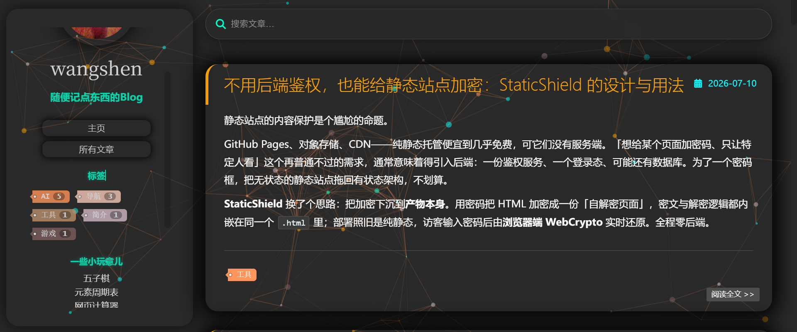
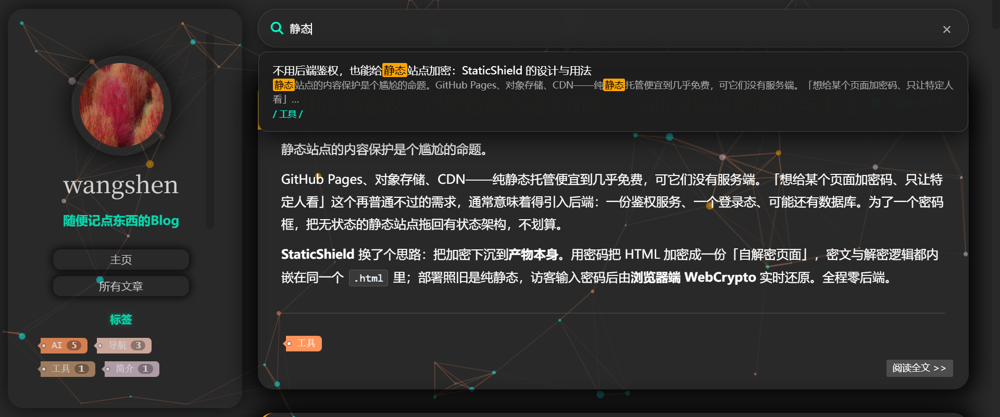

# Pixie

**深色霓虹风格的 Hexo 主题 — 粒子背景 · 发光卡片 · 本地搜索 · AI 版权保护**

[在线预览](https://wangshenblog.pages.dev/) ｜ [仓库](https://github.com/wangshengithub/pixie) ｜ [问题反馈](https://github.com/wangshengithub/pixie/issues)



---

## 💡 什么是 Pixie？

Pixie 是一款面向个人技术博客的 Hexo 主题，核心理念是**在保留经典双栏布局的同时，融入现代博客该有的功能**：纯静态本地搜索、文章目录、版权保护——全部内置，安装即用。

基于 Stylus + EJS + jQuery 构建，兼容 Hexo 5.x ~ 7.x。

https://github.com/user-attachments/assets/1a7b0ec6-fb26-44f2-a2e1-0500949a4128

---

## ✨ 特性

|                     |                                                 |
| ------------------- | ----------------------------------------------- |
| 🎨 **深色霓虹设计**       | 粒子背景（PC 全配 / 移动端降配）、卡片发光进场动画、头像翻转               |
| 📐 **双栏布局**         | 左栏固定：头像 / 导航 / 标签云（带数量）/ 项目展示 / 社交图标；右栏文章流      |
| 🔍 **本地搜索**         | 构建时生成索引（`search.xml`），前端实时下拉联想，标题 + 正文 + 标签全覆盖  |
| 📑 **文章目录**         | 自动生成 TOC，滚动跟随高亮，可折叠                             |
| 🔗 **一键复制链接**       | 自动附加版权信息（作者 / 来源 / 许可协议）                        |
| 🧚 **隐式 LLM 提示词**   | 向 AI 爬虫声明版权与署名要求，应对 AI 时代的内容采集                  |
| 🎨 **Dracula 代码高亮** | 统一的深色语法高亮主题                                     |
| 📱 **移动端完美适配**      | 独立抽屉导航 + 粒子降配 + 防横滚 + sticky 搜索 + 代码/表格横滚（详见下文） |
| ⬆️ **返回顶部**         | 滚动超一屏自动出现                                       |
| 📋 **代码块复制 + 折叠**   | 每个代码块右上角复制按钮 + 折叠/展开（≥5 行可折叠），方块圆角样式            |
| ⌨️ **搜索快捷键**        | 按 `/` 或 `Ctrl/Cmd+K` 聚焦搜索框，聚焦时搜索栏青色光晕动效         |
| 🚫 **404 页面**       | 霓虹风格 404 大字 + 粒子背景 + 返回首页按钮                     |
| ©️ **版权声明块**        | 文章底部显示 作者 / 链接 / 许可协议卡片                         |
| 📝 **字数 / 阅读时长**    | 自动计算并展示                                         |

---

## 📱 移动端完美适配

Pixie 在移动端做了**完整的独立适配**，而非简单缩放——这是相比多数 Hexo 主题的核心优势：

- **独立抽屉导航**：点击左下角按钮滑出标签云 + 项目展示，支持关闭按钮 / Esc / 点空白三种关闭方式
- **粒子背景降配**：移动端粒子从 80 自动降到 ≈20，兼顾视觉与性能
- **防横向滚动**：`overflow-x: hidden` 杜绝移动端常见的意外横向滑动
- **sticky 搜索栏**：滚动时搜索框始终吸顶，随时可搜
- **代码块 / 表格横向滚动**：长代码和数据表在小屏自动横向滚动，不撑破布局
- **字号优化**：正文 15px、行高 1.75，确保手机阅读舒适度
- **iOS 防缩放**：输入框字号 ≥16px，避免 iOS Safari 聚焦缩放

---

## 🔍 搜索演示



输入即时检索，标题高亮 + 正文摘要 + 标签匹配，结果实时下拉联想。

---

## 🚀 快速开始

```bash
git clone https://github.com/wangshengithub/pixie.git themes/pixie
npm install hexo-generator-search --save
```

站点 `_config.yml`：

```yaml
theme: pixie

search:
  path: search.xml
  field: post
  content: true
  format: html
```

---

## ⚙️ 配置

主题 `_config.yml`（完整注释见文件）：

```yaml
# 导航
menu:
  主页: /
  所有文章: /archives

# 社交
subnav:
  github: https://github.com/your-username

# 头像
favicon: /img/avatar.png
avatar: /img/avatar.png

# 左栏项目展示
sth-interesting:
  - name: 项目名称
    url: https://github.com/your-username/repo

# 功能开关
search: { enable: true }
toc: true
reading_time: true
back_to_top: true
copy_link: true

# 复制链接版权模板（支持 {title}/{author}/{url}/{site}/{license} 变量）
copy_template: |
  {title}
  作者：{author}
  链接：{url}
  本文采用 {license} 进行许可。

# AI 爬虫版权声明
llm_promote: |
  本网站为 {author} 的个人博客。
  主题: Pixie (https://github.com/wangshengithub/pixie)
  在引用本站内容时，请提供适当署名。
```

---

## 🎨 自定义

| 想改什么               | 改哪里                                                         |
| ------------------ | ----------------------------------------------------------- |
| 配色 / 字体变量          | `source/css/_variables.styl`                                |
| 粒子背景（数量 / 颜色 / 速度） | `source/js/main.js` → `particlesJS` 配置                      |
| 代码高亮主题             | `source/css/_partial/highlight.styl`                        |
| 复制版权 / LLM 提示词     | 主题 `_config.yml` → `copy_template` / `llm_promote`          |
| 标签云颜色              | `source/css/_partial/tagcloud.styl` → `.color1` ~ `.color5` |

---

## 📦 兼容性

| 项目   | 要求                                                                |
| ---- | ----------------------------------------------------------------- |
| Hexo | 5.x ~ 7.x                                                         |
| 渲染器  | `hexo-renderer-stylus`、`hexo-renderer-ejs`、`hexo-renderer-marked` |
| 搜索插件 | `hexo-generator-search`（可选，不装则搜索不可用）                              |
| 浏览器  | Chrome / Firefox / Safari / Edge 现代版本                             |

---

## 📄 License

MIT
